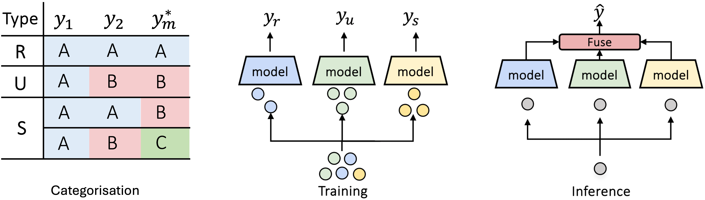

# MMoE in ChestX



This repository contains the code implementation of the Multimodal Mixture of Experts (MMoE) strategy for ChestX disease classification task. We apply the MMoE strategy to handle distinct multimodal interactions in the ChestX dataset.

## 1. Setup
**Clone the Repository**

```bash
git clone --recurse-submodules git@github.com:hwjustin/chestx.git
```

**Environment Setup**

```bash
conda env create -f chestx.yml
conda activate chestx
```

**Download ChestX Dataset**

```bash
invoke download --dataset chestx
```

## 2. Categorising Multimodal Interactions
```bash
# Unimodal Prediction from Text Modality
python categorisation/data_gen_text.py

# Unimodal Prediction from Image Modality
# Install DeepSeek-VL2, the dependency requirement by DeepSeek-VL2 is conflict with the other code, need to install separately and remove it after the unimodal prediction.
pip install -e ./DeepSeek-VL2
python categorisation/data_gen_image.py

# Categorising Training Samples
conda env update --file chestx.yml
python categorisation/chestx_split.py
```


## 3. Training Expert and Fusion Models
```bash
# Training Expert Models
bash blip2_chestx_expert_train.sh

# Training Fusion Models
bash blip2_chestx_fusion_train.sh
```


## 4. Inference with Mixture of Expert Models


## Acknowledgements